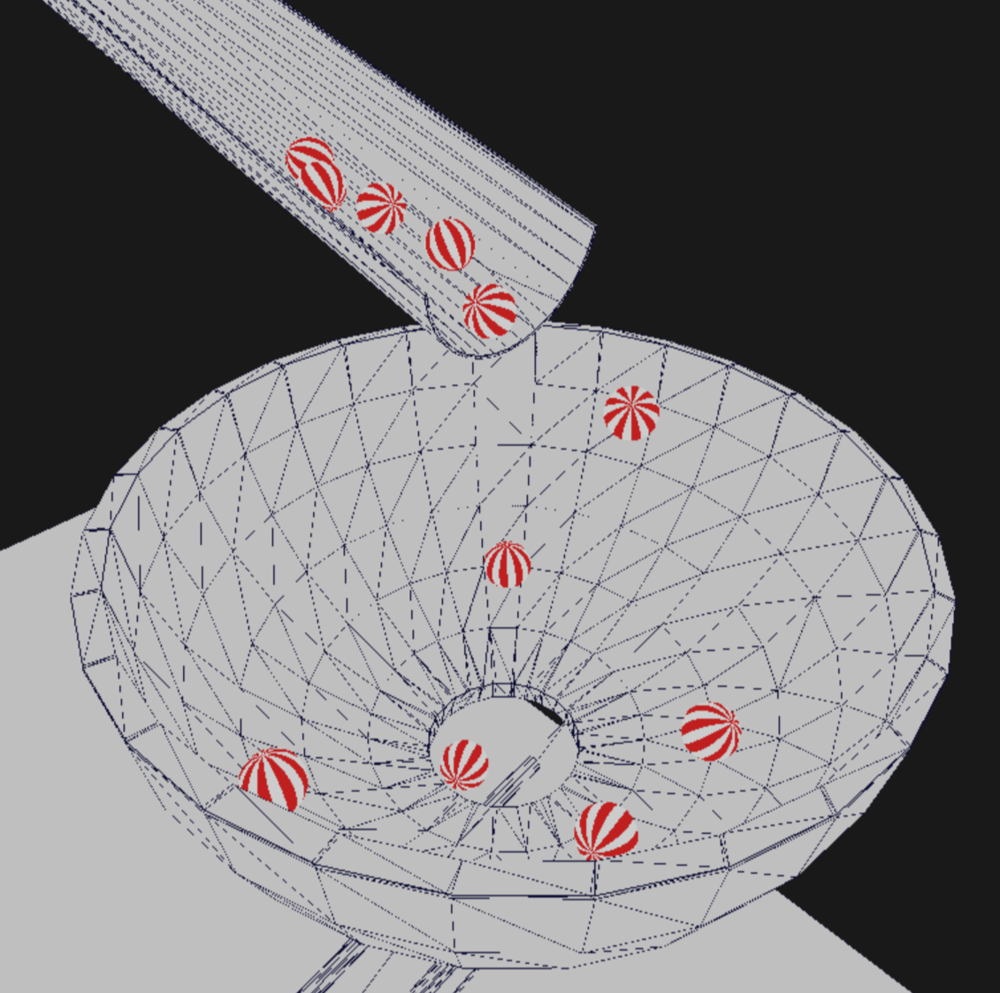

# [MarbleRun](https://akosseres.github.io/MarbleRun/)
Basic 3D rigid body physics simulation with spheres and arbitrary static geometry, demo running in the browser available [here](https://akosseres.github.io/MarbleRun/)!  
Controls:  
* WASD: move forwards/left/backwards/right
* Space: move upwards
* Left shift: move downwards
* Mouse: look around
* Mouse left button: "shoot" a ball
* Escape: release mouse lock
* R: remove all balls from the scene
* T: stop/start time
* P: save the current scene into a file with name *saved.scene* (only works in the native build)  

Additional scenes can be found in the folder called *scenes*. The scenes downloaded from this folder can be opened by drag-and-dropping one into the browser window while the app is running.



# Building
The same codebase is used across all build targets, with small differences between them. For the native build, CMake is used and for WASM there is a separate `build_wasm.sh` build script.
### WASM
Emscripten is used to compile and build the WASM target so the latest version of *[emsdk](https://emscripten.org/docs/getting_started/downloads.html)* should be installed and included in `PATH`. Can be built by running the script:
```
sh build_wasm.sh
```
After building the directory `dest` will contain the compiled webpage.
### Linux/Unix
CMake (`sudo apt install cmake` on Ubuntu...), SDL2 library (`sudo apt install libsdl2-dev`) and an OpenGL library (e.g. `sudo apt install libgles2-mesa-dev`) has to be installed before building, then build with:
```
mkdir build
cd build
cmake ..
make
```
The executable should be ready in the build directory along with the base.scene file.
